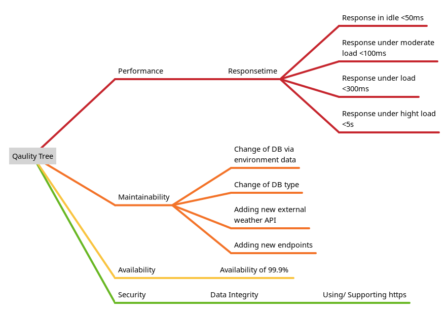

= ARC 42 Documentation
Birkenfunk
:toc: left

== Introduction and Goals

In this project a simple weather caching API should be realized. It gets it's weather from an external server and saves it into a RedisDB and returns it.

For this project the code is only one part additionally all code should be tested with different methods.

=== Requirements Overview 

For this project the minimum requirement was to have an external API, an own API, a database and a Frontend.

On top of this all functionality should be tested with unit tests, integration tests and end2end tests.

=== Quality Goals 

The primary quality goal of this project is to have maintainable code. This means that the code should be easy to read and understand and easy to change.

Additionally the code should be tested with different methods to ensure that the code is working as expected and that changes are unlikely break the program. To ensure this the code should be tested with unit tests, integration tests and end2end tests. Additionally the code should be linted to ensure that the code is written in a consistent way.

To ensure that the API has a high availability the API is tested with a load test.

=== Stakeholders
[cols="1,1,1", options="header"]
|===
| Role/Name| Contact| Expectations
| *User*| *-*| *Wants the API to be up 99.9% of the time*        
| *Admin*| *admin@email.com*| *Wants the App to run with a low resource consumption*   
|===     

== Architecture Constraints 

The interface of the external API is fixed and can not be changed.

The project has to contain a database, frontend and backend that talks to an external API

== System Scope and Context 

=== Business Context

image::.pictures/Business%20context%20Diagramm.png["Business Context", title="Business Context"]

=== Technical Context

image::.pictures/Technical%20context%20Diagramm.png["Technical Context", title="Technical Context"]

== Solution Strategy

=== Backend

As for the backend it was decided, to use the programming language go. The reason for this was, that go is a very light weight programming language and easy to use.

To implement the rest API the library https://go-chi.io/#/[go-chi] is used the reason for this framework is that is is a lightweight library that uses is based on Go functions and needs no external dependencies, but still has support for middleware like logging and some other features. Furthermore it is very fast see https://github.com/go-chi/chi=benchmarks[here]

For accessing the RedisDB the library https://github.com/gomodule/redigo[redingo] was used. This library has some features like connection pools that don't exist in the official redis driver.

=== Frontend

The programming language Dart was used for the frontend. The reason for this is that it supports the Framework Flutter.

Due to the simple programming of a frontend with Flutter, this framework was used. Additionally Flutter offers a lot of testing possibles, like unit tests, widget tests and integration tests, out of the box. This comes very handy if you want to do a click test. On top of with Flutter you only have to write the code one and run it on nearly any device (Android, IOS, Web, Linux, Windows, MacOs).

To call the Rest API of the backend dio was used. This library wraps the http library of Flutter and offers a simpler interface. Additionaly it offers some other useful features you can read https://pub.dev/packages/dio[here]

To supply the different states with the different objects the provider library was used. This wraps the InheritedWidget of Flutter and makes it much simpler.

== Building Block View 

== Runtime View 

[plantuml, runtime, png]
....
@startuml
actor Bob
participant App
participant WeatherApi
database Redis
Bob -> App: Enters URL of Weather Api
App -> WeatherApi: GET /health
WeatherApi -> App: 200 OK
App -> Bob: Shows weather page
Bob -> App: Request weather in munich
App -> WeatherApi: GET /weather/munich
WeatherApi -> Redis: GET munich
Redis -> WeatherApi: string "{"location":"munich", ...}"
WeatherApi -> App: 200 json {"location":"munich", ...}
App -> Bob: Shows weather for munich
Bob -> App: Requests weather in Berlin
App -> WeatherApi: GET /weather/berlin
WeatherApi -> Redis: GET berlin
Redis -> WeatherApi: null
WeatherApi -> ExternalWeatherApi: GET /weather/berlin
ExternalWeatherApi -> WeatherApi: 200 json {"location":"berlin", ...}
WeatherApi -> Redis: PUT string "{"location":"berlin",...}"
WeatherApi -> App: 200 json {"location":"berlin", ...}
App -> Bob: Shows weather for berlin
@enduml
....

== Deployment View

Due to the fact that the frontend is an application a user can run him self and the backend is a rest API, the backend has to be deployed on a server and the frontend is ether delivered via web or via download.

They are also developed in two different git repositories, so they can be deployed independently.
See the https://codeberg.org/Birkenfunk/SQS-Frontend[Frontend Repository] and the https://codeberg.org/Birkenfunk/SQS[Backend Repository]

For an easy deployment the backend is dockerized and can be deployed with docker-compose. As for the frontend the artefacts will be delivered via a git release and can be downloaded there (only the apk, Linux files and html files).

The RedisDB is in the same docker-compose file as the backend. If the RedisDB should be hosted on a different server, the backend has to be configured to use the other server.

== Cross-cutting Concepts 

image::.pictures/Cross-cutting-Concepts.png[]

== Architecture Decisions 

For the programming language decision see <<Solution Strategy>>

== Quality Requirements 

=== Quality Tree 

=== Quality Scenarios 

Respone time in idle state:

* Source: User
* Stimulus: User wants to see the weather
* Environment: Idle state
* Artifact: Backend
* Response: The backend should respond in less than 50ms
* Response Measure: The backend should respond in less than 50ms

Response time in high load state:

* Source: User
* Stimulus: User wants to see the weather
* Environment: High load state
* Artifact: Backend
* Response: The backend should respond in less than 5s
* Response Measure: The backend should respond in less than 5s

Change of DB via environment variable:
The admin wants to migrate the DB to a new server

* Source: Admin
* Stimulus: Admin wants to change the DB
* Environment: Any
* Artifact: Backend
* Response: The backend should change the DB after restart
* Response Measure: The backend uses the new DB

Change of DB technology:
The developer wants to add a new DB technology

* Source: Developer
* Stimulus: Developer wants to change the DB technology
* Environment: Any
* Artifact: Backend
* Response: The backend should use the new DB technology without much changes in the code the existing DB technology should still be supported 
* Response Measure: The backend should use a new DB technology with a new release

Adding new external weather API:
The developer wants to add a new external weather API with a different interface

* Source: Developer
* Stimulus: Developer wants to add a new external weather API
* Environment: Any
* Artifact: Backend
* Response: The backend should use the new external weather API
* Response Measure: The backend should use the new external weather API with a new release

Change of external weather API:
The admin wants to change the url of the external weather API

* Source: Admin
* Stimulus: Admin wants to change the url of the external weather API
* Environment: Any
* Artifact: Backend
* Response: The backend should change the url of the external weather API after restart
* Response Measure: The backend uses the new url for the external weather API

Change of weather API: The user wants to change the weather API

* Source: User
* Stimulus: User wants to change the weather API
* Environment: Production
* Artifact: Frontend
* Response: The frontend should change the weather API
* Response Measure: The frontend uses the new weather API

Adding new endpoint: The developer wants to add a new endpoint

* Source: Developer
* Stimulus: Developer wants to add a new endpoint
* Environment: Any
* Artifact: Backend
* Response: The backend should has new endpoints with a new release
* Response Measure: The backend has new endpoints

Using/ Supporting https: The user wants to access the API via https

* Source: User
* Stimulus: User wants to access the API via https
* Environment: Production
* Artifact: Frontend
* Response: The frontend should use https to access the API
* Response Measure: The frontend uses https to access the API

== Risks and Technical Debts 

* The external API could be down
** Probability: medium
** Impact: high
** Strategy: The backend should cache all requested weather data
** Measures to be taken on entry: The backend should return the cached data or status code 500
* The RedisDB could be down
** Probability: medium
** Impact: low
** Strategy: The backend should call the external API
** Measures to be taken on entry: The backend should return the data from the external API and reboot the RedisDB

* The web frontend could be down
** Probability: medium
** Impact: medium  
** Strategy: The frontend user could use the app on his phone or the linux app
